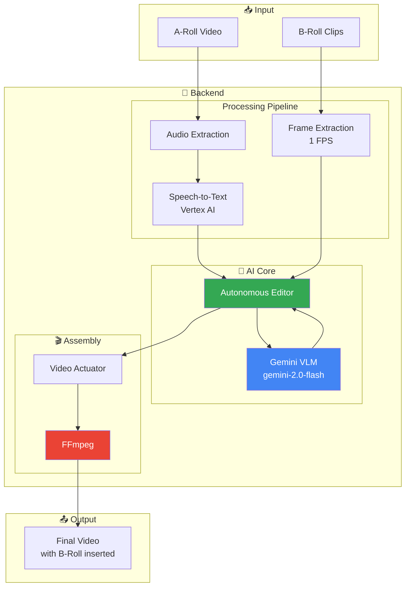
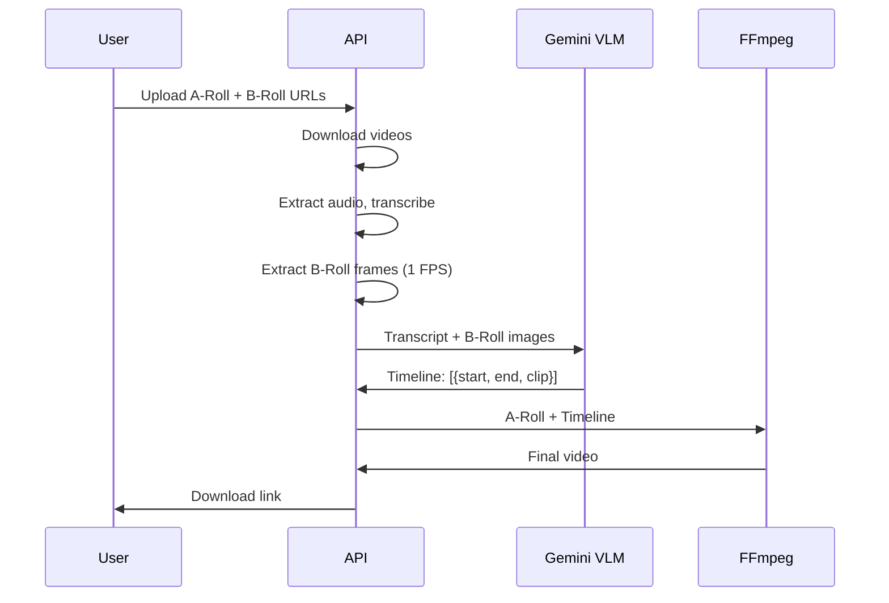

# 🎬 ClipSync

> **AI-Powered B-Roll Insertion** — Intelligently sync B-Roll clips to your A-Roll content with a single VLM call.

[](https://www.python.org/downloads/)
[](https://fastapi.tiangolo.com/)
[](https://streamlit.io/)

---

## � Demo

https://github.com/user-attachments/assets/demo.mp4

---

## �🎯 What It Does

Upload an A-Roll video (person talking) and B-Roll clips (supporting footage), and the AI automatically:

1. **Transcribes** the A-Roll audio
2. **Analyzes** B-Roll visuals using Gemini VLM
3. **Decides** where each B-Roll fits best
4. **Assembles** the final video with FFmpeg

**One API call. Fully autonomous. Works with any language.**

---

## 🏗️ Architecture



---

## 🔄 Data Flow



---

## 📁 Project Structure

```
├── backend/
│   ├── main.py                 # FastAPI endpoints
│   └── core/
│       ├── autonomous_editor.py  # VLM decision engine
│       ├── actuator.py           # FFmpeg video assembly
│       ├── audio_sensor_vertex.py # Speech-to-text
│       └── vision_sensor.py      # Frame extraction
│
├── frontend/
│   └── app.py                  # Streamlit UI
│
├── outputs/                    # Generated videos
├── uploads/                    # Temporary files
└── requirements.txt
```

---

## 🚀 Quick Start

### Prerequisites

- Python 3.11+
- FFmpeg installed and in PATH
- Google Cloud account with:
  - Vertex AI API enabled
  - Gemini API key

### 1. Clone & Install

```bash
git clone <repo-url>
cd clipsync

# Create virtual environment
python -m venv .venv
.venv\Scripts\activate  # Windows
source .venv/bin/activate  # Linux/Mac

# Install dependencies
pip install -r requirements.txt
```

### 2. Configure Environment

```bash
# Create .env file
echo "GOOGLE_API_KEY=your-gemini-api-key" > .env
echo "GOOGLE_CLOUD_PROJECT=your-gcp-project" >> .env
```

### 3. Run

```bash
# Terminal 1: Backend
uvicorn backend.main:app --host 0.0.0.0 --port 8000

# Terminal 2: Frontend
streamlit run frontend/app.py
```

### 4. Open

Navigate to `http://localhost:8501`

---

## 🎛️ API Endpoints

| Endpoint | Method | Description |
|----------|--------|-------------|
| `/api/process/json` | POST | Submit video URLs for processing |
| `/api/status/{job_id}` | GET | Check job status |
| `/api/download/{job_id}` | GET | Download final video |
| `/api/index/stats` | GET | System statistics |

### Example Request

```json
{
  "aroll_url": "https://example.com/talking_head.mp4",
  "broll_urls": [
    "https://example.com/cityscape.mp4",
    "https://example.com/food.mp4",
    "https://example.com/nature.mp4"
  ]
}
```

---

## 🧠 How the VLM Works

The core innovation is a **single multimodal VLM call** that:

1. **Sees** the B-Roll images (1 frame per clip)
2. **Reads** the transcript (any language)
3. **Decides** where to insert each B-Roll

### VLM Prompt (Simplified)

```
I have a 40s video with this transcript:
"{transcript}"

Here are B-Roll clips:
[IMAGE 1] [IMAGE 2] [IMAGE 3]...

TASK: Decide where to insert B-Roll.
You MUST use ALL clips.

OUTPUT:
{
  "cuts": [
    {"start": 2.5, "end": 7.5, "clip": 1},
    {"start": 10.0, "end": 15.0, "clip": 3}
  ]
}
```

### VLM Response → FFmpeg

```
VLM: {"cuts": [{"start": 2.5, "end": 7.5, "clip": 1}, ...]}
         ↓
FFmpeg: overlay=enable='between(t,2.5,7.5)'
         ↓
Final Video: B-Roll appears at 2.5s-7.5s
```

---

## ⚡ Key Features

| Feature | Description |
|---------|-------------|
| 🌐 **Any Language** | Works with Hindi, English, Spanish, etc. |
| 🎯 **Dynamic Cuts** | VLM decides how many cuts (not hardcoded) |
| 📹 **All Clips Used** | Validates all B-Roll clips appear |
| 🔄 **Single API Call** | One VLM request for full timeline |
| ⚡ **Fast Assembly** | FFmpeg filter_complex for efficient rendering |

---

## 🛠️ Tech Stack

| Component | Technology |
|-----------|------------|
| Backend | FastAPI |
| Frontend | Streamlit |
| VLM | Gemini 2.0 Flash |
| Speech-to-Text | Vertex AI STT |
| Video Processing | FFmpeg |
| Package Manager | UV / pip |

---

## 📊 Performance

| Metric | Value |
|--------|-------|
| VLM Latency | ~3-5 seconds |
| Video Assembly | ~10-30 seconds |
| Supported Video Length | Up to 5 minutes |
| B-Roll Clips | Up to 10 clips |

---

## 🔧 Troubleshooting

### FFmpeg not found
```bash
# Windows
winget install ffmpeg

# Mac
brew install ffmpeg

# Ubuntu
sudo apt install ffmpeg
```

### API Key Issues
```bash
# Verify your key works
curl "https://generativelanguage.googleapis.com/v1beta/models?key=YOUR_KEY"
```

### B-Roll not appearing
- Check video codec compatibility
- Ensure B-Roll clips are accessible
- Check FFmpeg stderr in logs

---

## 📄 License

MIT License - See [LICENSE](LICENSE)

---

## 🤝 Contributing

1. Fork the repository
2. Create feature branch (`git checkout -b feature/amazing`)
3. Commit changes (`git commit -m 'Add amazing feature'`)
4. Push to branch (`git push origin feature/amazing`)
5. Open Pull Request

---

<p align="center">
  <b>Built with ❤️ by Himanshu Gupta</b>
</p>
